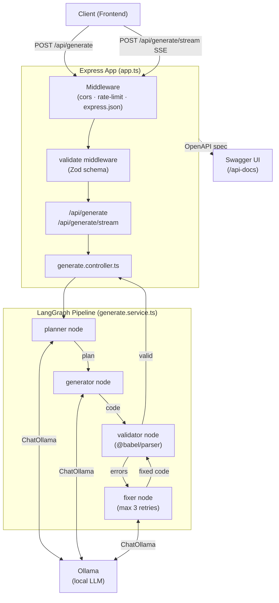

# React UI Generator — Backend

A REST API that accepts a natural-language prompt and returns a generated React component. The generation pipeline is orchestrated with **LangGraph**, running through a planner → generator → validator → fixer loop against a local **Ollama** model.

---

## Tech Stack

| Tool                                                                               | Version | Role                                                        |
| ---------------------------------------------------------------------------------- | ------- | ----------------------------------------------------------- |
| [Node.js](https://nodejs.org)                                                      | 18+     | Runtime                                                     |
| [Express](https://expressjs.com)                                                   | ^5.2    | HTTP framework                                              |
| [TypeScript](https://www.typescriptlang.org)                                       | ^6.0    | Static typing                                               |
| [Zod](https://zod.dev)                                                             | ^4.3    | Request validation and schema inference                     |
| [@asteasolutions/zod-to-openapi](https://github.com/asteasolutions/zod-to-openapi) | ^8.5    | OpenAPI spec generation from Zod schemas                    |
| [swagger-ui-express](https://github.com/scottie1984/swagger-ui-express)            | ^5.0    | Swagger UI served at `/api-docs`                            |
| [express-rate-limit](https://github.com/express-rate-limit/express-rate-limit)     | ^8.3    | Per-IP rate limiting                                        |
| [cors](https://github.com/expressjs/cors)                                          | ^2.8    | CORS header management                                      |
| [@langchain/langgraph](https://langchain-ai.github.io/langgraphjs/)                | ^1.3    | AI workflow graph (planner → generator → validator → fixer) |
| [@langchain/ollama](https://github.com/langchain-ai/langchainjs)                   | ^1.2    | Ollama LLM integration                                      |
| [@langchain/core](https://github.com/langchain-ai/langchainjs)                     | ^1.1    | LangChain message primitives                                |
| [@babel/parser](https://babeljs.io/docs/babel-parser)                              | ^7.29   | JSX/TypeScript syntax validation in the validator node      |
| [dotenv](https://github.com/motdotla/dotenv)                                       | ^17.4   | Environment variable loading                                |
| [nodemon](https://nodemon.io) + [ts-node](https://typestrong.org/ts-node/)         | —       | Dev server with hot reload                                  |

---

## Installation Guide

### Prerequisites

- **Node.js** 18 or later
- **Ollama** running locally with your chosen model pulled (default: `llama3`)

### Steps

1. **Clone the repository**

   ```bash
   cd "backend"
   ```

2. **Install dependencies**

   ```bash
   npm install
   ```

3. **Pull the Ollama model**

   ```bash
   ollama pull llama3
   ```

4. **Configure environment variables**

   ```bash
   copy .env.example .env
   ```

   Edit `.env` with your values — see [Environment Variables](#environment-variables) below.

5. **Start the development server**

   ```bash
   npm run dev
   ```

   The API will be available at `http://localhost:3000`.  
   Swagger UI is at `http://localhost:3000/api-docs`.

---

## Environment Variables

| Variable               | Default                  | Description                                                   |
| ---------------------- | ------------------------ | ------------------------------------------------------------- |
| `PORT`                 | `3000`                   | Port the server listens on                                    |
| `CORS_OPTIONS`         | `{"origin":"*",...}`     | JSON string of CORS settings — update `origin` for production |
| `RATE_LIMIT_WINDOW_MS` | `900000`                 | Rate limit window in milliseconds (default: 15 min)           |
| `RATE_LIMIT_MAX`       | `100`                    | Max requests per window per IP                                |
| `OLLAMA_BASE_URL`      | `http://localhost:11434` | Base URL of the local Ollama instance                         |
| `OLLAMA_MODEL`         | `llama3`                 | Model name to invoke for generation                           |

---

## API Endpoints

### `POST /api/generate`

Runs the full LangGraph pipeline and returns the generated component code in a single JSON response.

**Request body**

```json
{ "prompt": "A pricing card for a pro subscription" }
```

**Response `200`**

```json
{
  "prompt": "A pricing card for a pro subscription",
  "model": "llama3",
  "generatedCode": "import ...",
  "generatedAt": "2026-06-07T10:00:00.000Z"
}
```

---

### `POST /api/generate/stream`

Same pipeline but streams progress as **Server-Sent Events (SSE)**, then emits a final `complete` event.

**Request body** — same as above.

**SSE event stream**

```
data: {"stage":"planner","progress":25}

data: {"stage":"generator","progress":55}

data: {"stage":"validator","progress":75}

data: {"stage":"complete","progress":100,"result":{"prompt":"...","model":"llama3","generatedCode":"...","generatedAt":"..."}}
```

If the validator finds errors the `fixer` node re-runs (up to 3 times), emitting progress between 80–90 on each attempt.

---

## LangGraph Pipeline

The AI workflow is a directed graph compiled with `@langchain/langgraph`:

```
START → planner → generator → validator ──(valid)──→ END
                                        ↑                ↓
                                        └── fixer ←──(invalid, < 3 attempts)
```

| Node          | Responsibility                                                                                                      |
| ------------- | ------------------------------------------------------------------------------------------------------------------- |
| **planner**   | Asks the LLM to outline the component: name, state, and key UI elements                                             |
| **generator** | Asks the LLM to produce a complete TSX component based on the plan, constrained to the allowed LifeSG component set |
| **validator** | Parses the code with `@babel/parser` and checks for a default export and no props — pure, synchronous check         |
| **fixer**     | Sends the errors back to the LLM and asks for a corrected version; increments `fixAttempts`                         |

The validator routes back to the fixer up to **3 times** before accepting whatever code exists.

---

## Architecture Diagram


