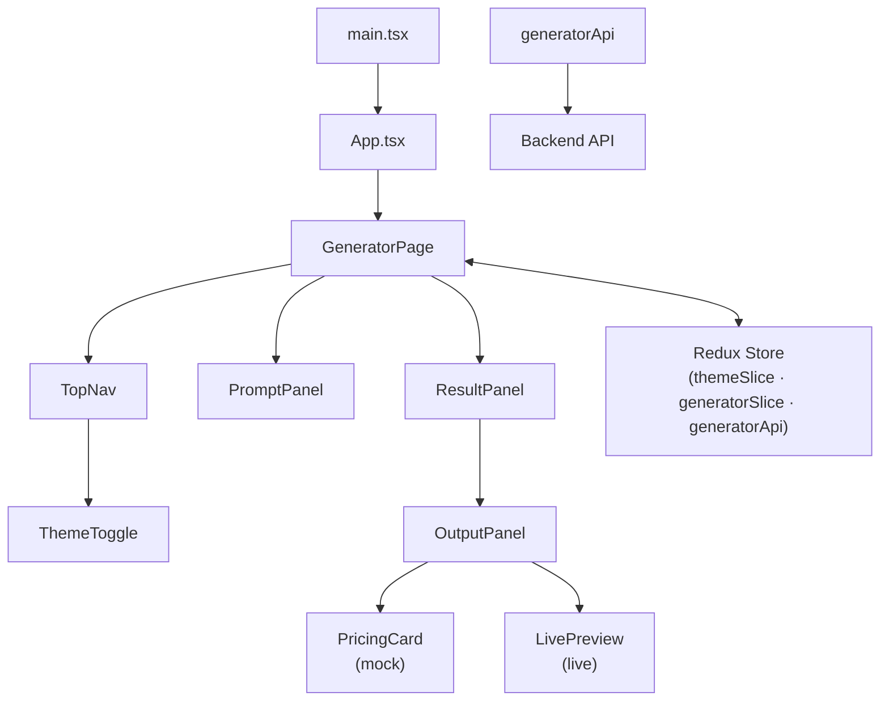

# React UI Generator — Frontend

A browser-based tool that accepts a natural-language prompt and returns a generated React UI component, with a live preview and source-code view.

---

## Tech Stack

| Tool                                                                         | Version            | Role                                       |
| ---------------------------------------------------------------------------- | ------------------ | ------------------------------------------ |
| [Vite](https://vitejs.dev)                                                   | ^8.0               | Dev server and bundler                     |
| [React](https://react.dev)                                                   | ^19.2              | UI rendering                               |
| [TypeScript](https://www.typescriptlang.org)                                 | ~6.0               | Static typing                              |
| [React Router DOM](https://reactrouter.com)                                  | ^7.17              | Client-side routing                        |
| [Redux Toolkit](https://redux-toolkit.js.org)                                | ^2.12              | Global state management                    |
| [RTK Query](https://redux-toolkit.js.org/rtk-query/overview)                 | (bundled with RTK) | API calls and mutation state               |
| [styled-components](https://styled-components.com)                           | ^6.4               | Component-scoped CSS-in-JS                 |
| [@lifesg/react-design-system](https://github.com/LifeSG/react-design-system) | ^3.3.0             | UI component library and design tokens     |
| [@lifesg/react-icons](https://github.com/LifeSG/react-icons)                 | ^1.18.0            | Icon set                                   |
| [@babel/standalone](https://babeljs.io/docs/babel-standalone)                | ^7.29              | Runtime JSX transpilation in `LivePreview` |
| [Zod](https://zod.dev)                                                       | ^4.4               | API request/response validation            |
| [@floating-ui/react](https://floating-ui.com)                                | ^0.27              | Tooltip/popover positioning                |

---

## Installation Guide

### Prerequisites

- **Node.js** 22
- **npm** 9 or later (or compatible package manager)

### Steps

1. **Navigate to repository**

   ```bash
   cd frontend
   ```

2. **Install dependencies**

   ```bash
   npm install
   ```

3. **Configure environment variables** (see [Environment Variables](#environment-variables))

   ```bash
   copy .env.example .env   # or create .env manually
   ```

4. **Start the development server**

   ```bash
   npm run dev
   ```

## Environment Variables

| Variable            | Default                     | Description                                                                                                                    |
| ------------------- | --------------------------- | ------------------------------------------------------------------------------------------------------------------------------ |
| `VITE_USE_MOCK_API` | `true`                      | Set to `"false"` to send real requests to the live backend. When `"true"`, responses are simulated locally with a 2.5 s delay. |
| `VITE_API_BASE_URL` | `http://localhost:3000/api` | Base URL of the backend API. Only used when `VITE_USE_MOCK_API=false`.                                                         |

---

## LifeSG React Design System Components

### `DSThemeProvider` + `LifeSGTheme`

**Import:** `@lifesg/react-design-system/theme`

For automatically managing dark/light theme

---

### `Layout`

**Import:** `@lifesg/react-design-system/layout`

Create a responsive layout with 2 sections.

---

### `Typography`

**Import:** `@lifesg/react-design-system/typography`

Ensures that text are standardised.

---

### `Button`

**Import:** `@lifesg/react-design-system/button`

Ensure that buttons across the application are standardised in terms of color and size.

---

### `Tab`

**Import:** `@lifesg/react-design-system/tab`

Used as a toggle between different tabs.

---

### `Pill`

**Import:** `@lifesg/react-design-system/pill`

To create a chip or badge shape component.

---

### `Card`

**Import:** `@lifesg/react-design-system/card`

Use Card component as a box. Ensure that color is base on active theme.

---

### `Divider`

**Import:** `@lifesg/react-design-system/divider`

Used as a divider. Component is used to ensure that it map to the theme.

---

## Mermaid Diagram


