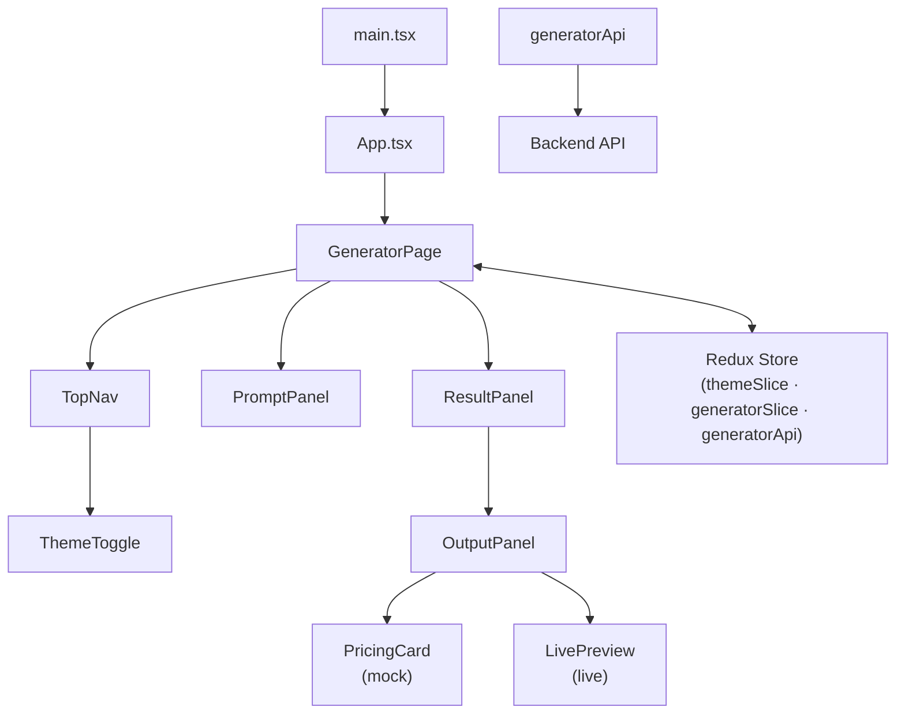

# React UI Generator — Frontend

A browser-based tool that accepts a natural-language prompt and returns a generated React UI component, with a live preview and source-code view.

---

## Tech Stack

| Tool                                                                         | Version            | Role                                       |
| ---------------------------------------------------------------------------- | ------------------ | ------------------------------------------ |
| [Vite](https://vitejs.dev)                                                   | ^8.0               | Dev server and bundler                     |
| [React](https://react.dev)                                                   | ^19.2              | UI rendering                               |
| [TypeScript](https://www.typescriptlang.org)                                 | ~6.0               | Static typing                              |
| [React Router DOM](https://reactrouter.com)                                  | ^7.17              | Client-side routing                        |
| [Redux Toolkit](https://redux-toolkit.js.org)                                | ^2.12              | Global state management                    |
| [RTK Query](https://redux-toolkit.js.org/rtk-query/overview)                 | (bundled with RTK) | API calls and mutation state               |
| [styled-components](https://styled-components.com)                           | ^6.4               | Component-scoped CSS-in-JS                 |
| [@lifesg/react-design-system](https://github.com/LifeSG/react-design-system) | ^3.3.0             | UI component library and design tokens     |
| [@lifesg/react-icons](https://github.com/LifeSG/react-icons)                 | ^1.18.0            | Icon set                                   |
| [@babel/standalone](https://babeljs.io/docs/babel-standalone)                | ^7.29              | Runtime JSX transpilation in `LivePreview` |
| [Zod](https://zod.dev)                                                       | ^4.4               | API request/response validation            |
| [@floating-ui/react](https://floating-ui.com)                                | ^0.27              | Tooltip/popover positioning                |

---

## Installation Guide

### Prerequisites

- **Node.js** 22
- **npm** 9 or later (or compatible package manager)

### Steps

1. **Clone the repository**

   ```bash
   git clone <repo-url>
   cd "Assignment 2/frontend"
   ```

2. **Install dependencies**

   ```bash
   npm install
   ```

3. **Configure environment variables** (see [Environment Variables](#environment-variables))

   ```bash
   cp .env.example .env   # or create .env manually
   ```

4. **Start the development server**

   ```bash
   npm run dev
   ```

## Environment Variables

| Variable            | Default                     | Description                                                                                                                    |
| ------------------- | --------------------------- | ------------------------------------------------------------------------------------------------------------------------------ |
| `VITE_USE_MOCK_API` | `true`                      | Set to `"false"` to send real requests to the live backend. When `"true"`, responses are simulated locally with a 2.5 s delay. |
| `VITE_API_BASE_URL` | `http://localhost:3000/api` | Base URL of the backend API. Only used when `VITE_USE_MOCK_API=false`.                                                         |

---

## LifeSG React Design System Components

All components are imported from `@lifesg/react-design-system` sub-paths and styled via `styled-components` using the library's `Colour.*` design tokens.

### `DSThemeProvider` + `LifeSGTheme`

**Import:** `@lifesg/react-design-system/theme`  
**Used in:** `App.tsx`

Wraps the entire application and injects the active theme (light or dark) into every LifeSG component and `Colour.*` token interpolation. Required for any design-system component to render correctly. The active variant (`LifeSGTheme.light` / `LifeSGTheme.dark`) is driven by the `colourMode` value in the Redux `themeSlice`.

---

### `Typography.*`

**Import:** `@lifesg/react-design-system/typography`  
**Used in:** `TopNav`, `PromptPanel`, `ResultPanel`, `OutputPanel`, `PricingCard`

Variants used across the app:

| Variant                | Where                                                  |
| ---------------------- | ------------------------------------------------------ |
| `Typography.HeadingXL` | Price display in `PricingCard`                         |
| `Typography.HeadingSM` | Section headings in `ResultPanel`, `PricingCard`       |
| `Typography.HeadingXS` | App title in `TopNav`, state headings in `ResultPanel` |
| `Typography.HeadingMD` | Prompt panel section label                             |
| `Typography.BodyMD`    | Descriptive text, feature list items                   |
| `Typography.BodySM`    | Sub-labels, billing notes                              |
| `Typography.BodyXS`    | Meta information (model name, timestamp)               |

Using `Typography.*` instead of raw `<p>` or `<h*>` tags ensures every text node inherits the correct font family, weight, line height, and responsive scaling from the design system theme — eliminating manual font-size decisions.

---

### `Button.Default`

**Import:** `@lifesg/react-design-system/button`  
**Used in:** `PromptPanel`, `ResultPanel`, `PricingCard`

| `styleType`   | Where                                                           | Purpose                         |
| ------------- | --------------------------------------------------------------- | ------------------------------- |
| `"default"`   | "Generate UI" in `PromptPanel`, "Get Started" in `PricingCard`  | Primary call-to-action          |
| `"secondary"` | "Try again" in `ResultPanel` error state                        | Non-destructive recovery action |
| `"light"`     | "Reset" in `ResultPanel`, example chip buttons in `PromptPanel` | Low-emphasis actions            |

The `loading` prop (used on the Generate button) provides a built-in spinner state without requiring a separate loading indicator component.

---

### `Tab` + `Tab.Item`

**Import:** `@lifesg/react-design-system/tab`  
**Used in:** `OutputPanel`

Renders the **Preview** / **Code** tab bar beneath the generated result. The `fullWidthIndicatorLine` prop stretches the underline indicator to the full container width, matching the layout's visual treatment. Using the design-system `Tab` ensures consistent keyboard navigation, focus management, and active-indicator animation that would otherwise require manual implementation.

---

### `Pill`

**Import:** `@lifesg/react-design-system/pill`  
**Used in:** `PricingCard`

Renders the **"Most Popular"** badge pinned above the pricing card. The `type="solid"` and `colorType="primary"` props apply the brand primary fill, making the badge stand out without needing custom color overrides.

---

### `Card`

**Import:** `@lifesg/react-design-system/card`  
**Used in:** `PricingCard.styles.ts` (as `styled(Card)`)

Provides the surface background, border-radius, and elevation shadow for the pricing card. Extending it with `styled(Card)` allows adding custom padding and border rules while inheriting the correct background token (`bg-primary`) and ensuring the card respects the active theme.

---

### `Divider`

**Import:** `@lifesg/react-design-system/divider`  
**Used in:** `PricingCard`

Draws the horizontal rule between the plan header and the feature list. Using `Divider` ensures the separator color maps to the correct `border` token for both light and dark themes, instead of a hardcoded `border-top` color.

---

### `TickCircleFillIcon`

**Import:** `@lifesg/react-icons/tick-circle-fill`  
**Used in:** `PricingCard.styles.ts` (as `styled(TickCircleFillIcon)`)

Renders the checkmark beside each feature list item. Styled via `Colour["icon-primary"]` so the icon color follows the theme, and sized to `18px` to align vertically with `Typography.BodyMD` text.

---

## Mermaid Diagram


